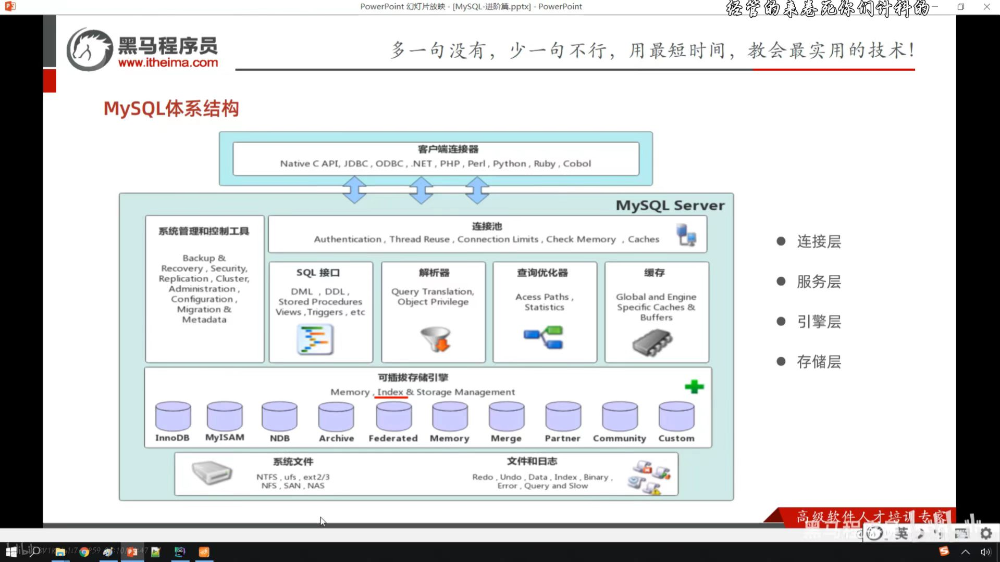

# 网络编程

## protobuf序列化

- 只需要protobuf序列化后出入原本的string位置即可
- 多用于后端的gRPC通讯

---

# MySQL

## 存储引擎

### mysql体系



- 连接层
- 服务层
- 引擎层
- 存储层

### 引擎

- 可插拔存储引擎
- 要用了下载加载

### 简介

- 是存储数据、建立索引、更新/查询数据等技术的实现方式
- 是基于表的，一个数据库可以有多个存储引擎

### 查询引擎

```sql
show create table account;
```

- 可以再最后看到ENGINE = ....

### INNODB

- 是MySQL5.5+后的默认引擎
- 是兼顾高可靠性和高性能的通用存储引擎

#### 特点

- DML遵循ACID，支持事务
- 行级锁，提高访问性能
- 支持外键
- 最大存储64T数据

#### 文件

- xxx.ibd为其表存储的后缀名
- 表结构(sdi(+frm))+数据+索引=.ibd
- 后续frm移入sdi之中
- 参数为innodb_file_per_table
- 当innodb_file_per_table=1，则对应有一个表结构
#### 逻辑存储结构
- TableSpece:表空间
- Segment:段
- Extent:区
- Page:页
- Row:行
- 一个TableSpece->n个Segment->n\*m个Extent(=1M，max(m)=64)->n\*m\*q个Page(=16K)->n\*m\*p\*q个Row
##### Row包含
- Trxid:事务id
- Roll pointer:指针
- col1:数据1
- ……
- ……
- ……
### MyISAM
- MySQL早期存储引擎
#### 特点
- 不支持事务，外键
- 支持表锁，不支持行锁
- 访问速度快
#### 文件
- .MYD表数据
- .MYI索引
- .sdi表结构（文本文件，json文件）
### Memory
- 数据存储在内存，不能长期存储
#### 特点
- 内存存放
- hash索引
- 不支持事务，外键
- 支持表锁，不支持行锁
### 选择
- 根据需求选择存储引擎
#### Innodb
-  一般主选
#### MyISAM
- 以读和插入为主选
- 日志
#### MEMORY
- 将数据保存于内存中。用于临时表的缓存